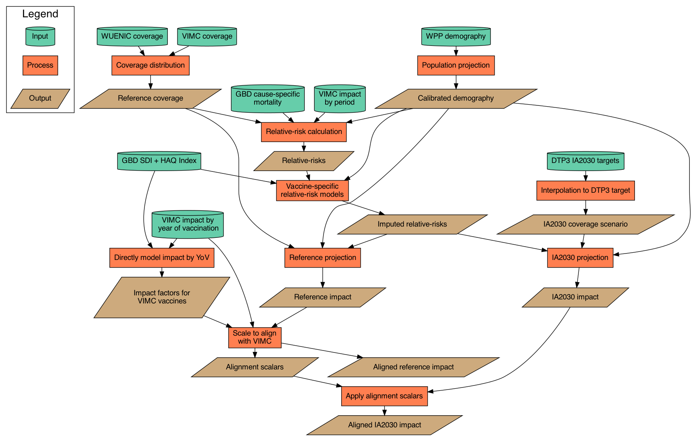

<!-- badges: start -->

<!-- badges: end -->

# Vaccine Impact Estimates for IA2030

This package includes the tools used to generate vaccine impact estimates for IA2030

## Methods

We will use the cohort component method of population projection (CCMPP) to simulate counterfactual scenarios for mortality in the absence of vaccines.

### Coverage

We plan to pull coverage from a mixture of WUENIC estimates and reported country data. Summarize 

### Instructions

1. Pull the `main` branch
2. Open R and run:
> devtools::load_all()
3. Generate the database by runnning:
> gen_db()
4. Open the `main.R` script and run interactively
