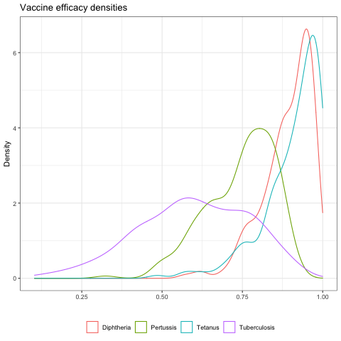

# IA 2030 Uncertainty Analysis

## Problem statement
In our initial approach to estimating averted burden, we generated uncertainty intervals by propagating only a single dimension of input uncertainty and did not include uncertainty coming from our modeled parameter estimates. To more accurately capture uncertainty in our vaccine impact estimates, we transitioned to stratifying our analyses by draw from start to finish, as well as sampling from the estimated joint distribution of our relative-risk model parameters. The result is uncertainty intervals that better reflect the expanding uncertainty associated with extrapolating VIMC results to new locations and separately modeling new pathogens with GBD inputs.

## Motivation for Latin hypercube sampling of inputs
Latin hypercube sampling (LHS) is a generalization of the Latin square concept in which samples are spread evenly throughout each dimension so that there is only one sample in each row and each column. Relative to simply sampling randomly from each dimension, the LHS approach leads to better coverage of the joint distribution inputs with fewer samples, especially as the number of dimensions grows. We employ LHS to generate sets of input draws from the distributions of our indepedent and dependent variables that reduce the overall computational requirements of our analysis. (more efficient!)

## Steps for IA2030 uncertainty analysis
1. Generate draws for uncertain inputs that report ranges (e.g. IQR, 95% UI)
2. Set up location-specific LHS sampling for HAQi, GBD deaths, VIMC deaths, vaccine efficacy for input to regression
3. Perform the regression for each draw combination
4. Take a single draw from the prediction interval of the relative-risk model
5. Execute the VIMC calibration step using the mean of the draws and multiplicatively scale the full draw-level distributions

## Input uncertainty
### Vaccine efficacy 
  
_Method_:
  - Fit a beta distribution (domain of zero to one) for each disease to the reported mean, lower CI, and upper CI, by minimizing the total absolute difference between the reported summary statistics and the summary statistics associated with the parameterized beta distribution
  - Extra weight was given to the mean difference in the objective function to ensure prioritization of alignment in the mean over alignment in the confidence intervals

_Limitations_:
   - Difficult to achieve alignment between all three summary statistics, especially when the mean efficacy is very close to one

#### Vaccine efficacy data
|Disease|Vaccine|Mean |Lower|Upper|Source                                                                        |
|-------|-------|-----|-----|-----|------------------------------------------------------------------------------|
|D      |DTP3   |0.969|0.943|0.984|https://apps.who.int/iris/bitstream/handle/10665/258681/WER9231.pdf?sequence=1|
|T      |DTP3   |0.99 |0.8  |1    |https://apps.who.int/iris/bitstream/handle/10665/233093/WER8120_198-208.PDF   |
|P      |DTP3   |0.8  |0.71 |0.86 |https://www.ncbi.nlm.nih.gov/pmc/articles/PMC5088088/                         |
|TB     |BCG    |0.66 |0.08 |0.88 |https://bmcmedicine.biomedcentral.com/articles/10.1186/s12916-016-0685-4      |

### VIMC deaths averted uncertainty
  
_Method_:
  - Calculate the normal standard deviation that aligns with the reported IQR
  - Sample from a normal distribution with estimated mean and calculated standard devation for each location, disease, vaccine, activity-type, age

_Limitations_:
  - We are assuming a normal distribution for inputs that are not necessarily normally distributed
  - We do not retain temporal correlation for a given location/disease combination

### GBD deaths observed and HAQi uncertainty
  
_Method_:
  - Calculate the normal standard deviation that aligns with the reported 95% prediction interval

_Limitations_:
  - Again, we are assuming a normal distribution for inputs that are not necessarily normally distributed and are failing to retain temporal correlation for a given location/disease combination

### Inputs currently missing uncertainty
- SDI and all-cause mortality

## Location-specific Latin hypercube sampling (LHS)
_Method_:
  - We need to rank draws before indexing with the LHS indices so that the sampling approach effectively spans the input distributions
    - This seems odd, but we believe that without doing this we would simply be mirroring random sampling, as there would be no meaning to the index value for each distribution. Looking forward to feedback on this.
  - We generate the LHS draw indices at the location-specific level to avoid draw-level correlation across locations, which would arbitrarily inflate uncertainty during aggregation

## Sampling draws from fit models and VIMC calibration 
_Method_: 
  - For each set of input draws, fit our regression model and generate a single random sample from the poster multivariate normal distibution using the estimated beta coefficients and the variance-covariance matrix
    - Using the `mvrnorm` function from the MASS package in R
  - Calculate the mean across draws and compare to the VIMC estimated mean to generate scalars for multiplicatively shifting full distributions of estimated draws so that IA2030 agrees with VIMC at the mean level in countries for which VIMC generates estimates.

## Remaining steps
- Finish up full uncertainty analysis and compare to previous uncertainty estimates for different aggregates (e.g. disease, income group)
- Repeat analysis while leaving out uncertainty from individual inputs to determine the contributions of each input to overall uncertainty
